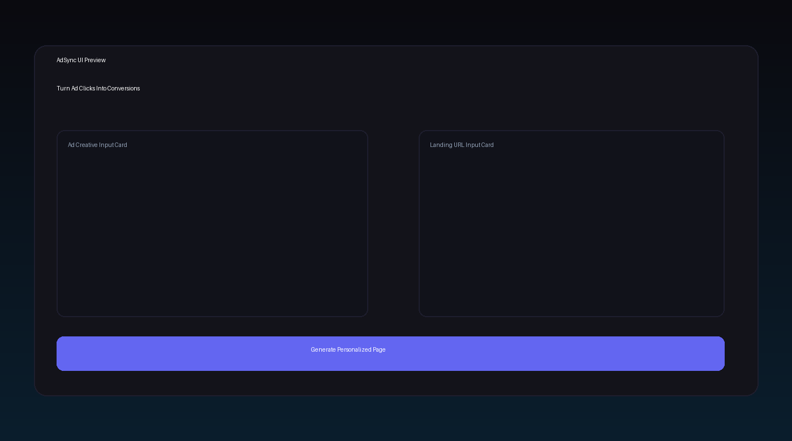

# AdSync

AdSync is an AI-powered full-stack web app that takes:
- ad creative input (upload or image URL)
- landing page URL

and returns a personalized, CRO-aligned version of the landing page copy with:
- rewritten headline/subheadline/body/CTA
- message-match score before vs after
- field-level CRO rationale
- recommendation cards
- export actions (JSON / copy / HTML snippet)

## Tech Stack

- Frontend: React + Vite
- Styling: Tailwind via CDN + custom CSS
- Backend: Node.js + Express
- AI: Anthropic Claude (`claude-sonnet-4-20250514`)
- Scraping: axios + cheerio
- Upload: multer

## One-command local setup

```bash
npm install && npm run dev
```

This starts:
- backend: `http://localhost:3001`
- frontend: `http://localhost:5173`

## Environment variables

Copy `.env.example` to `.env` in project root:

```env
ANTHROPIC_API_KEY=sk-ant-...
PORT=3001
VITE_API_URL=http://localhost:3001
```

You can also copy `client/.env.example` to `client/.env` if needed.

## Claude settings used

- Ad analysis:
  - `model: "claude-sonnet-4-20250514"`
  - `max_tokens: 2000`
  - `temperature: 0.2`
- Personalization:
  - `model: "claude-sonnet-4-20250514"`
  - `max_tokens: 4000`
  - `temperature: 0.3`

## API routes

- `POST /api/analyze-ad`
  - multipart file (`image`) OR JSON `{ imageUrl }`
- `POST /api/scrape-page`
  - JSON `{ url }`
- `POST /api/personalize`
  - JSON `{ adAnalysis, pageContent }`

## Screenshot



## Live demo

`[PASTE LIVE DEMO LINK HERE]`

